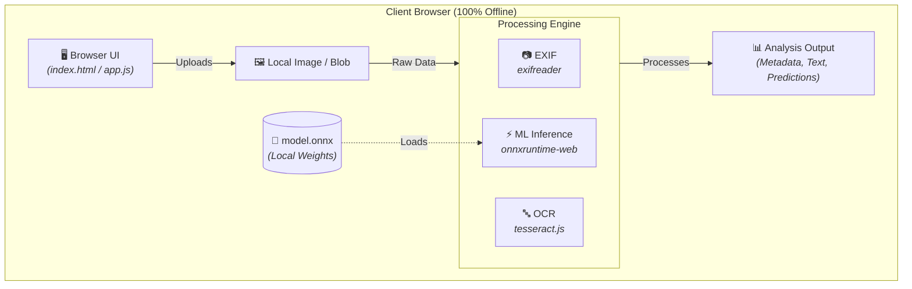

# SynthLensAI 🚀🖼️  

**SynthLensAI** is a privacy-first, in-browser image analysis application. It extracts EXIF metadata, performs Optical Character Recognition (OCR), and executes lightweight machine learning inference completely on the client side using `exifreader`, `tesseract.js`, and `onnxruntime-web`. It ships with a bundled `model.onnx` file, meaning zero server dependencies are required for core image processing.

---

## 📋 Table of Contents

- [Features](#-features)
- [Architecture](#-architecture)
- [Prerequisites & Installation](#-prerequisites--installation)
- [Usage & Code Examples](#-usage--code-examples)
  - [1. EXIF Extraction (`exifreader`)](#1-exif-extraction-exifreader)
  - [2. In-Browser OCR (`tesseract.js`)](#2-in-browser-ocr-tesseractjs)
  - [3. ONNX Model Inference (`onnxruntime-web`)](#3-onnx-model-inference-onnxruntime-web)
- [Project Directory Structure](#-project-directory-structure)
- [Development Scripts](#-development-scripts)
- [Contributing Instructions](#-contributing-instructions)
- [License](#-license)

---

## ✨ Features

* **🔒 Privacy-First**: All image processing happens locally—your image data never leaves the browser.
* **📷 Deep EXIF Parsing**: Extract camera specs, timestamps, and GPS data using `exifreader`.
* **🔤 In-Browser OCR**: Recognize and extract text directly from images using WebAssembly-backed `tesseract.js`.
* **🧠 Client-Side ML Inference**: Run quantized ONNX models locally using WebGL or WASM execution providers via `onnxruntime-web`.
* **⚡ Lightweight Prototype**: Simple HTML + JS structure (`index.html`, `app.js`) designed for rapid testing and zero-friction setup.

---

## 🏗️ Architecture Diagram



The diagram above illustrates the client-side execution flow: user interface components feed uploaded images directly into modular processing engines (EXIF parsing, OCR extraction, and ONNX inference). The loaded ML model weights (`model.onnx`) and image blobs remain securely within the client's local memory.

---

## ⚙️ Prerequisites & Installation

### 1. Prerequisites
* **Node.js**: `v14.0.0` or higher with `npm` installed.
* **Browser**: Modern WebAssembly-compatible browser (*Chrome, Edge, or Firefox recommended*).

### 2. Installation
Clone the repository and install the project dependencies:

```bash
# 1. Clone the repository
git clone [https://github.com/your-org/SynthLensAI.git](https://github.com/your-org/SynthLensAI.git)
cd SynthLensAI

# 2. Install dependencies
npm install

# 3. Start the local development server
npm start

