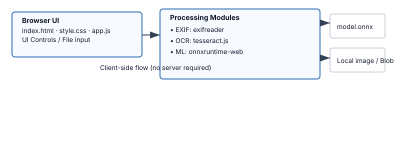
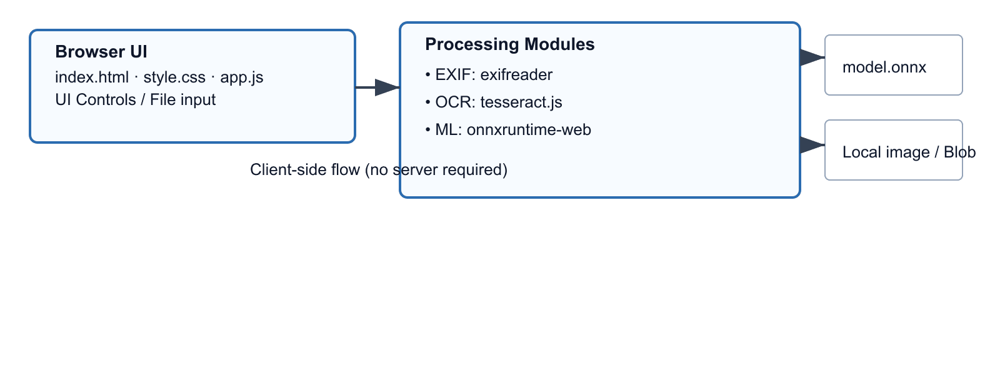

# SynthLensAI 🚀🖼️  

Concise Description
- SynthLensAI is an in-browser image analysis app that extracts image metadata, performs OCR, and runs lightweight ML inference locally using `exifreader`, `tesseract.js`, and `onnxruntime-web`. It ships with a bundled `model.onnx` for client-side inference and runs entirely in the browser — no server required for core processing.

Table of Contents
- Key Features
- Architecture Diagram
- Prerequisites & Installation
- Usage & Code Examples
  - EXIF extraction with `exifreader`
  - OCR with `tesseract.js`
  - ONNX inference with `onnxruntime-web`
- Project Directory Structure
- Development Scripts
- Contributing Instructions
- License

Key Features
- Client-side EXIF metadata extraction from photos.
- Browser OCR (Optical Character Recognition) using `tesseract.js`.
- Local ONNX model inference with `onnxruntime-web` (WASM/WebGL).
- Minimal privacy exposure: image data never leaves the client.
- Simple HTML + JS single-page app (`index.html`, `app.js`) for quick demos and prototyping.

Architecture Diagram




The diagram above illustrates the client-side flow: UI components feed images into processing modules (EXIF extraction, OCR, and ONNX inference). The model weights (`model.onnx`) and local image/blob remain on the client unless explicitly uploaded.

Prerequisites & Installation
1. Prerequisites
   - Node.js v14+ and npm (for local dev server and dependency management)
   - Modern browser (Chrome, Edge, Firefox). For best performance use Chrome/Edge.
2. Install
   - Clone the repo:
     ```bash
     git clone https://github.com/your-org/SynthLensAI.git
     cd SynthLensAI
     ```
   - Install dependencies:
     ```bash
     npm install
     ```
   - Run a dev server (examples below use `serve` or an npm script):
     ```bash
     npm start
     ```
   - Open `index.html` in your browser (or visit `http://localhost:5000` if using a static server).

Usage & Code Examples
- Notes:
  - All examples assume they are running in the browser context (ES modules or bundler).
  - Adapt imports depending on your bundler (Webpack/Rollup) or plain script tags.

1) EXIF extraction with `exifreader`
- Example: read EXIF tags from a file input
```html
<input id="file" type="file" accept="image/*" />
<script type="module">
import ExifReader from 'exifreader';

const input = document.getElementById('file');
input.addEventListener('change', async (e) => {
  const file = e.target.files[0];
  if (!file) return;
  const arrayBuffer = await file.arrayBuffer();
  const tags = ExifReader.load(arrayBuffer);
  console.log('EXIF tags:', tags);
  // Common tags: tags.Make, tags.Model, tags.DateTimeOriginal
});
</script>
```

2) OCR with `tesseract.js`
- Example: extract text from an image element or file blob
```js
import { createWorker } from 'tesseract.js';

async function runOCR(imageOrBlob) {
  const worker = createWorker({
    logger: m => console.log(m), // optional progress updates
  });
  await worker.load();
  await worker.loadLanguage('eng');
  await worker.initialize('eng');
  // imageOrBlob can be an HTMLImageElement, image URL, or a Blob/File
  const { data: { text } } = await worker.recognize(imageOrBlob);
  console.log('OCR result:', text);
  await worker.terminate();
  return text;
}
```

3) ONNX inference with `onnxruntime-web`
- Example: load `model.onnx`, prepare an input tensor, and run inference
```js
import * as ort from 'onnxruntime-web';

async function runOnnxModel(inputFloat32Array, inputShape = [1, 3, 224, 224]) {
  // Create session (WASM or WebGL execution provider will be chosen automatically)
  const session = await ort.InferenceSession.create('model.onnx', {
    executionProviders: ['wasm', 'webgl'] // optional preference order
  });

  // Create input tensor (must match model input name and shape)
  const inputTensor = new ort.Tensor('float32', inputFloat32Array, inputShape);
  const feeds = { input: inputTensor }; // replace 'input' with your model's input name

  const results = await session.run(feeds);
  // Access result by output name, e.g., results.output
  const outputNames = Object.keys(results);
  const output = results[outputNames[0]];
  console.log('ONNX output tensor:', output.data);
  return output;
}
```

Project Directory Structure (ASCII)
- Top-level layout (example):
```
SynthLensAI/
├─ index.html
├─ app.js
├─ style.css
├─ model.onnx
├─ package.json
├─ README.md
└─ assets/
   ├─ images/
   └─ data/
```
- Key files:
  - `index.html` — single-page UI and entry point
  - `app.js` — main client logic that wires EXIF, OCR, and ONNX flows
  - `model.onnx` — bundled ONNX model for client inference
  - `package.json` — project metadata and scripts

Development Scripts
- Common `npm` commands (add these to `package.json` scripts)
| Command | Description |
|---|---|
| `npm start` | Start a local static server for `index.html` (recommended for dev) |
| `npm run serve` | Serve the `dist/` or project root via `serve` or similar static server |
| `npm run build` | Build/pack assets (if you add a bundler step) |
| `npm test` | Run tests (none by default) |
| `npm run lint` | Run linters (optional) |

Example package.json scripts snippet (for copy/paste)
```json
{
  "scripts": {
    "start": "npx serve . -p 5000",
    "serve": "npx serve . -p 5000",
    "build": "echo \"Add bundler build step here\" && exit 0",
    "test": "echo \"No tests configured\" && exit 0",
    "lint": "echo \"No linter configured\" && exit 0"
  }
}
```

Contributing Instructions
- Contribution process
  - Fork the repository and create a feature branch: `git checkout -b feature/your-feature`
  - Open a pull request with a clear title and description.
  - Keep changes focused and document new behaviors in `README.md` or an accompanying doc.
- Coding standards
  - Keep frontend code modular and document new public functions.
  - Prefer clear variable names and avoid one-letter identifiers.
- Tests & QA
  - Add simple manual reproduction steps for UI features.
  - If adding heavy model/code changes, include a short benchmark or accuracy note.

License
- This project is released under the MIT License.
- Copyright (c) Your Name / Organization

If you want, I can also update `package.json` scripts or add a small dev server configuration.
