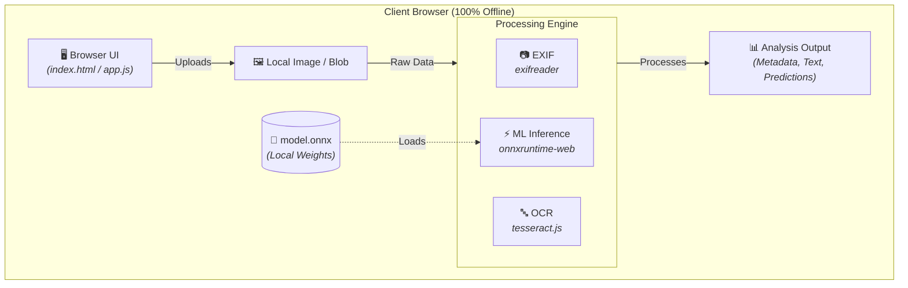

# SynthLensAI 🚀🖼️  

**SynthLensAI** is a privacy-first, in-browser image analysis application. It extracts EXIF metadata, performs Optical Character Recognition (OCR), and executes lightweight machine learning inference completely on the client side using `exifreader`, `tesseract.js`, and `onnxruntime-web`. It ships with a bundled `model.onnx` file, meaning zero server dependencies are required for core image processing.

---

## 📋 Table of Contents

- [Features](#-features)
- [Architecture](#-architecture)
- [Prerequisites & Installation](#-prerequisites--installation)
- [Usage & Code Examples](#-usage--code-examples)
  - [1. EXIF Extraction (`exifreader`)](#1-exif-extraction-exifreader)
  - [2. In-Browser OCR (`tesseract.js`)](#2-in-browser-ocr-tesseractjs)
  - [3. ONNX Model Inference (`onnxruntime-web`)](#3-onnx-model-inference-onnxruntime-web)
- [Project Directory Structure](#-project-directory-structure)
- [Development Scripts](#-development-scripts)
- [Contributing Instructions](#-contributing-instructions)
- [License](#-license)

---

## ✨ Features

* **🔒 Privacy-First**: All image processing happens locally—your image data never leaves the browser.
* **📷 Deep EXIF Parsing**: Extract camera specs, timestamps, and GPS data using `exifreader`.
* **🔤 In-Browser OCR**: Recognize and extract text directly from images using WebAssembly-backed `tesseract.js`.
* **🧠 Client-Side ML Inference**: Run quantized ONNX models locally using WebGL or WASM execution providers via `onnxruntime-web`.
* **⚡ Lightweight Prototype**: Simple HTML + JS structure (`index.html`, `app.js`) designed for rapid testing and zero-friction setup.

---

## 🏗️ Architecture Diagram



The diagram above illustrates the client-side execution flow: user interface components feed uploaded images directly into modular processing engines (EXIF parsing, OCR extraction, and ONNX inference). The loaded ML model weights (`model.onnx`) and image blobs remain securely within the client's local memory.

---

## ⚙️ Prerequisites & Installation

### 1. Prerequisites
* **Node.js**: `v14.0.0` or higher with `npm` installed.
* **Browser**: Modern WebAssembly-compatible browser (*Chrome, Edge, or Firefox recommended*).

### 2. Installation
Clone the repository and install the project dependencies:

```bash
# 1. Clone the repository
git clone [https://github.com/your-org/SynthLensAI.git](https://github.com/your-org/SynthLensAI.git)
cd SynthLensAI

# 2. Install dependencies
npm install

# 3. Start the local development server
npm start 

```
Open `http://localhost:5000` in your web browser to view the application.

---

## 💡 Usage & Code Examples

> **Note:** All examples run within a client-side browser context (ES Modules).

### 1. EXIF Extraction (`exifreader`)

Read EXIF tags directly from a browser File input:

```html
<input id="file" type="file" accept="image/*" />

<script type="module">
import ExifReader from 'exifreader';

const input = document.getElementById('file');
input.addEventListener('change', async (e) => {
  const file = e.target.files[0];
  if (!file) return;

  const arrayBuffer = await file.arrayBuffer();
  const tags = ExifReader.load(arrayBuffer);
  
  console.log('EXIF tags:', tags);
  // Example properties: tags.Make, tags.Model, tags.DateTimeOriginal
});
</script> 


```

### 2. In-Browser OCR (`tesseract.js`)

Extract text from an HTML image element, URL, or File Blob:

```javascript
import { createWorker } from 'tesseract.js';

async function runOCR(imageOrBlob) {
  const worker = await createWorker({
    logger: m => console.log(m), // Progress updates
  });
  
  await worker.load();
  await worker.loadLanguage('eng');
  await worker.initialize('eng');

  const { data: { text } } = await worker.recognize(imageOrBlob);
  console.log('OCR result:', text);
  
  await worker.terminate();
  return text;
}

``` 
### 3. ONNX Model Inference (`onnxruntime-web`)

Load `model.onnx`, construct an input tensor, and execute local inference:

```javascript
import * as ort from 'onnxruntime-web';

async function runOnnxModel(inputFloat32Array, inputShape = [1, 3, 224, 224]) {
  // Create an inference session with preferred execution providers
  const session = await ort.InferenceSession.create('model.onnx', {
    executionProviders: ['wasm', 'webgl'],
  });

  // Construct the input tensor (match your model's target input shape/name)
  const inputTensor = new ort.Tensor('float32', inputFloat32Array, inputShape);
  const feeds = { input: inputTensor };

  // Run model inference
  const results = await session.run(feeds);
  
  // Parse output data
  const outputNames = Object.keys(results);
  const output = results[outputNames[0]];
  console.log('ONNX output tensor:', output.data);
  
  return output;
}
}

```
---
## 📂 Project Directory Structure

```text
SynthLensAI/
├── index.html        # Single-page application entry point
├── app.js            # Core logic wiring EXIF, OCR, and ONNX workflows
├── style.css         # UI styling rules
├── model.onnx        # Bundled ONNX model file
├── package.json      # Dependencies and execution scripts
├── README.md         # Project documentation
└── assets/
    ├── architecture.svg # System architecture diagram
    ├── images/       # Static UI image assets
    └── data/         # Sample dataset/testing payloads

```
---

## 🧪 Development Scripts

The following standard `npm` commands are defined inside `package.json`:

| Command | Description |
| :--- | :--- |
| `npm start` | Starts a local static server on port `5000` via `serve`. |
| `npm run serve` | Alias for `npm start`. |
| `npm run build` | Asset compilation step *(placeholder for future bundlers)*. |
| `npm test` | Runs tests *(none configured by default)*. |
| `npm run lint` | Runs code quality linters *(none configured by default)*. |

### Sample `package.json` Scripts Block

```json
{
  "scripts": {
    "start": "npx serve . -p 5000",
    "serve": "npx serve . -p 5000",
    "build": "echo \"Add bundler build step here\" && exit 0",
    "test": "echo \"No tests configured\" && exit 0",
    "lint": "echo \"No linter configured\" && exit 0"
  }
}

```    
## 🤝 Contributing Instructions

1. **Submit Changes**:
   * Fork the repository.
   * Create a dedicated feature branch: `git checkout -b feature/your-feature-name`.
   * Commit your changes and push your branch.
   * Open a Pull Request with a descriptive summary of your changes.

2. **Coding Standards**:
   * Keep frontend components modular and well-documented.
   * Use clean, explicit variable names over single-letter identifiers.

3. **QA & Testing**:
   * Provide step-by-step reproduction instructions for any UI changes.
   * Include brief performance/accuracy benchmarks if updating model weights or execution providers.

---

## 📄 License

Distributed under the **MIT License**. See `LICENSE` for more information.
